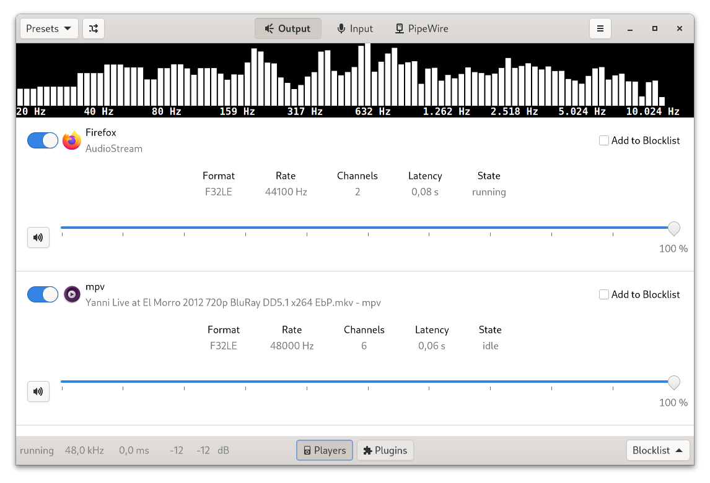
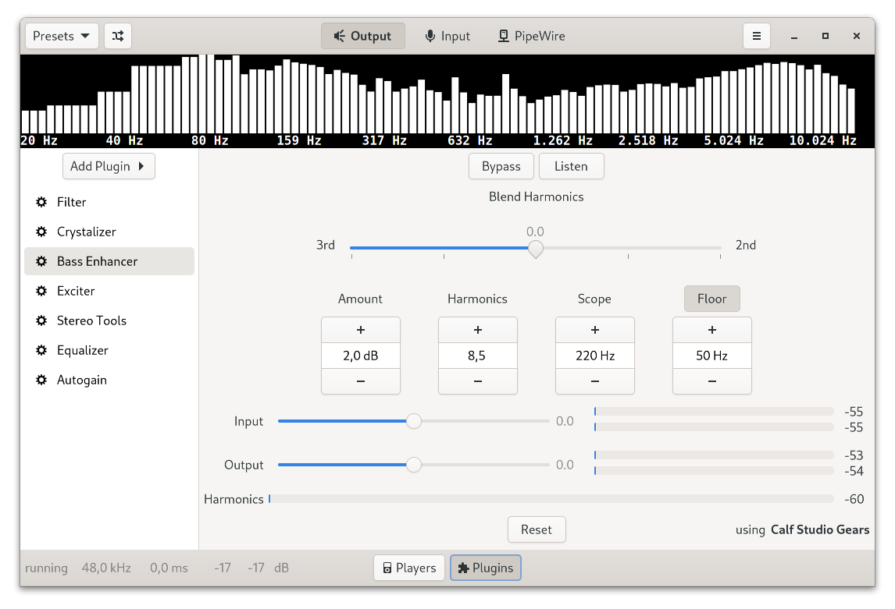

# EasyEffects

[](https://circleci.com/gh/wwmm/easyeffects)
[](https://liberapay.com/wwmm/donate)

Audio effects for PipeWire applications.





## Effects available

- Auto gain
- Bass enhancer
- Compressor
- Convolver
- Crossfeed
- Crystalizer
- De-esser
- Echo Canceller
- Equalizer
- Exciter
- Expander
- Filter (low-pass, high-pass, band-pass and band-reject modes)
- Gate
- Limiter
- Loudness
- Maximizer
- Multiband compressor
- Multiband gate
- Noise reduction
- Pitch
- Reverberation
- Stereo tools

The user has full control over the effects order. Just use the up/down arrows
next to the plugin label at the left side. To be able to use all plugins you
must have the following installed in your system:

- [Linux Studio plugins](http://lsp-plug.in/?page=home). Version 1.1.24 or higher.
- [Calf Studio plugins](https://calf-studio-gear.org/). Version 0.90.1 or higher.
- [libebur128](https://github.com/jiixyj/libebur128). For Auto Gain.
- [ZamAudio plugins](http://www.zamaudio.com/). For Maximizer.
- [zita-convolver](https://kokkinizita.linuxaudio.org/linuxaudio/). For Convolver.
- [rubberband](https://www.breakfastquay.com/rubberband/). For Pitch Shift.
- [RNNoise](https://github.com/xiph/rnnoise). For Noise Reduction.
- [libsamplerate](http://www.mega-nerd.com/SRC/index.html)
- [libsndfile](http://www.mega-nerd.com/libsndfile/)
- [libbs2b](https://sourceforge.net/projects/bs2b/files/libbs2b/)
- [fftw](https://fftw.org/)
- [speexdsp](https://www.speex.org/)
- [nlohmann json](https://github.com/nlohmann/json)

## Donate

You can help me to keep developing EasyEffects through donations. Any amount will be greatly appreciated :-)

<table>
  <tr>
    <td><a href="https://liberapay.com/wwmm/">https://liberapay.com/wwmm</a></td>
    <td><a href="https://liberapay.com/wwmm/donate"></a></td>
  </tr>
  <tr>
    <td>https://www.patreon.com/wellingtonwallace?fan_landing=true</td>
    <td>Patreon</td>
  </tr>
</table>

## Changelog

- For information about changes between versions take a look at our
  [changelog](https://github.com/wwmm/easyeffects/blob/master/CHANGELOG.md)

## Installation

### GNU/Linux packages

<!-- - [Arch Linux](https://www.archlinux.org/packages/community/x86_64/easyeffects/) / [AUR Git version](https://aur.archlinux.org/packages/easyeffects-git/)
- [Void Linux](https://github.com/void-linux/void-packages/blob/master/srcpkgs/easyeffects/template)
- [Gentoo](https://packages.gentoo.org/packages/media-sound/easyeffects)
- [ROSA](https://abf.io/import/easyeffects/)
- [ALT Linux](https://packages.altlinux.org/Sisyphus/srpms/easyeffects/)
- [Fedora GNU/Linux](https://apps.fedoraproject.org/packages/easyeffects)
- [CRUX](https://crux.nu/portdb/?a=search&q=easyeffects)
- [openSUSE](https://software.opensuse.org/package/easyeffects)
- [NixOS](https://search.nixos.org/packages?channel=unstable&show=easyeffects&query=easyeffects)
- [Debian (buster)](https://packages.debian.org/buster-backports/easyeffects) / [Debian (bullseye)](https://packages.debian.org/bullseye/easyeffects) -->

#### Community packages

<!-- These are community maintained repositories of distribution packages. You can
find more information about these in the
[wiki](https://github.com/wwmm/easyeffects/wiki/Package-Repositories#package-repositories).

- [Ubuntu and Debian](https://github.com/wwmm/easyeffects/wiki/Package-Repositories#debian--ubuntu) -->

### Flatpak

<!-- [Flatpak](https://flatpak.org/) packages support multiple Linux distributions and are sandboxed.

Stable releases are hosted on
[Flathub](https://flathub.org/apps/details/com.github.wwmm.easyeffects):

```
flatpak remote-add --if-not-exists flathub https://flathub.org/repo/flathub.flatpakrepo
flatpak install flathub com.github.wwmm.easyeffects

``` -->

#### Installing from source

See the wiki: [Installing from Source](https://github.com/wwmm/easyeffects/wiki/Installation-from-Source), for detailed instructions.

## Documentation

EasyEffects documentation can be read inside the GUI installing
[yelp](https://gitlab.gnome.org/GNOME/yelp) package.

## Frequently asked questions

Take a look at our [FAQ](https://github.com/wwmm/easyeffects/wiki/FAQ) to see
if you are facing a known problem.

## Command-line options

See the wiki: [Command Line Options](https://github.com/wwmm/easyeffects/wiki/Command-Line-Options)

## Community presets

See the wiki: [Community presets](https://github.com/wwmm/easyeffects/wiki/Community-presets)

## Reporting bugs

See the wiki: [Reporting Bugs](https://github.com/wwmm/easyeffects/wiki/Reporting-bugs)

## Translating EasyEffects

See the wiki: [Translating EasyEffects](https://github.com/wwmm/easyeffects/wiki/Translating-EasyEffects), for detailed instructions.

## License

EasyEffects is licensed under GNU General Public License version 3. See [LICENSE file](https://github.com/wwmm/easyeffects/blob/master/LICENSE.md).

```

```
