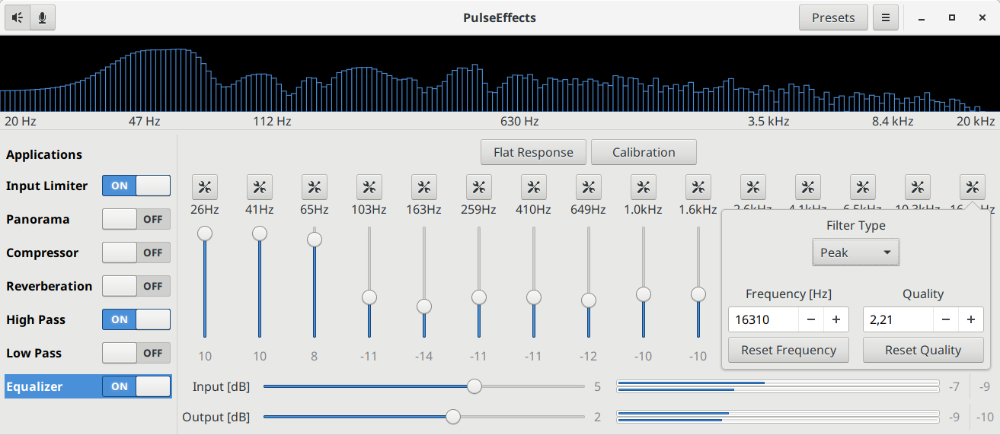

# PulseEffects

Limiter, compressor, reverberation, stereo equalizer and auto volume effects for
Pulseaudio applications





Order of effects applied to applications output:

1. Input Limiter (Ladspa Fast Lookahead Limiter)
2. Auto Volume
3. Stereo Panorama (Gstreamer)
4. Compressor (Ladspa SC4)
5. Freeverb (Gstreamer)
6. Equalizer Input Gain (Gstreamer volume)
7. Butterworth Highpass filter (Gstreamer audiocheblimit)
8. Butterworth Lowpass filter (Gstreamer audiocheblimit)
9. 15 bands Equalizer (Gstreamer)
10. Equalizer Output Gain (Gstreamer volume)
11. Output Limiter (Ladspa Fast Lookahead Limiter)
12. Spectrum Analyzer (Gstreamer)

Since version 2.0.0 PulseEffects is capable of applying effects to microphone
output at the same time it applies them for applications output:

1. Input Limiter (Ladspa Fast Lookahead Limiter)
2. Compressor (Ladspa SC4)
3. Freeverb (Gstreamer)
4. Equalizer Input Gain (Gstreamer volume)
5. Butterworth Highpass filter (Gstreamer audiocheblimit)
6. Butterworth Lowpass filter (Gstreamer audiocheblimit)
7. 15 bands Equalizer (Gstreamer)
8. Equalizer Output Gain (Gstreamer volume)
9. Output Limiter (Ladspa Fast Lookahead Limiter)
10. Spectrum Analyzer (Gstreamer)

## Installation

Users upgrading from 1.x to 2.x will have to rebuild their presets. Since
version 2.0.0 PulseEffects uses a different format. This
change was necessary to support presets for microphone processing.

### GNU/Linux Packages

- [Arch Linux](https://aur.archlinux.org/packages/pulseeffects/)

### Flatpak

[Flatpak](https://flatpak.org) packages support multiple distributions and are sandboxed.

Stable releases are hosted on [Flathub](https://flathub.org):

```
flatpak remote-add --if-not-exists flathub https://flathub.org/repo/flathub.flatpakrepo
flatpak install flathub com.github.wwmm.pulseeffects
```

### Source Code

Required libraries:

- Python 3
- Python configparser (Included with Python3 > 3.5.0. There is
  no need to install it.)
- [PyGObject](https://pygobject.readthedocs.io/en/latest/)
- [Python Cairo](https://cairographics.org/pycairo/)
- [Python Numpy](http://www.numpy.org/)
- [Python Scipy](https://scipy.org/scipylib/) (0.18 or above)
- Gtk 3.18 or above
- Gstreamer, Gstreamer Plugins Good, Gstreamer Plugins Bad and Gstreamer Python
 (Since version 1.4.3 Pulseeffects needs Gstreamer 1.12 or above)
- [swh-plugins](https://github.com/swh/ladspa) from Ladspa

See the wiki: [Installing from Source](https://github.com/wwmm/pulseeffects/wiki/Installation-from-Source), for detailed instructions.

## Command Line Options

See the wiki: [Command Line Options](https://github.com/wwmm/pulseeffects/wiki/Command-Line-Options)

## Translating PulseEffects

See the wiki: [Translating PulseEffects](https://github.com/wwmm/pulseeffects/wiki/Translating-PulseEffects), for detailed instructions.
