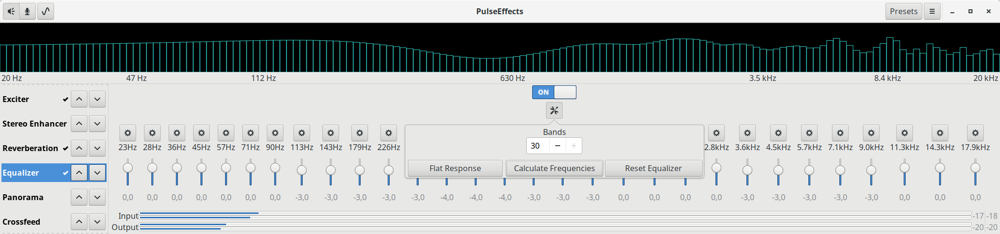
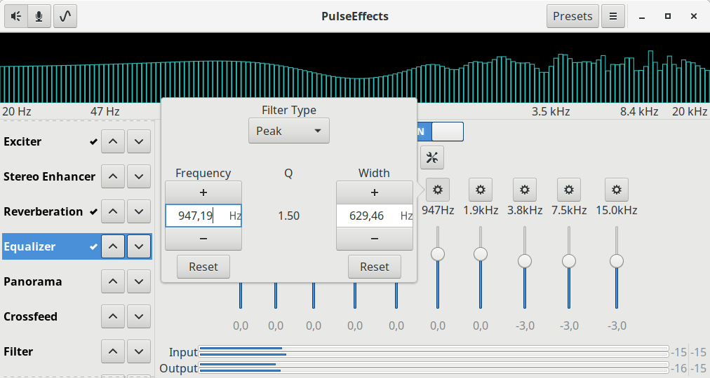
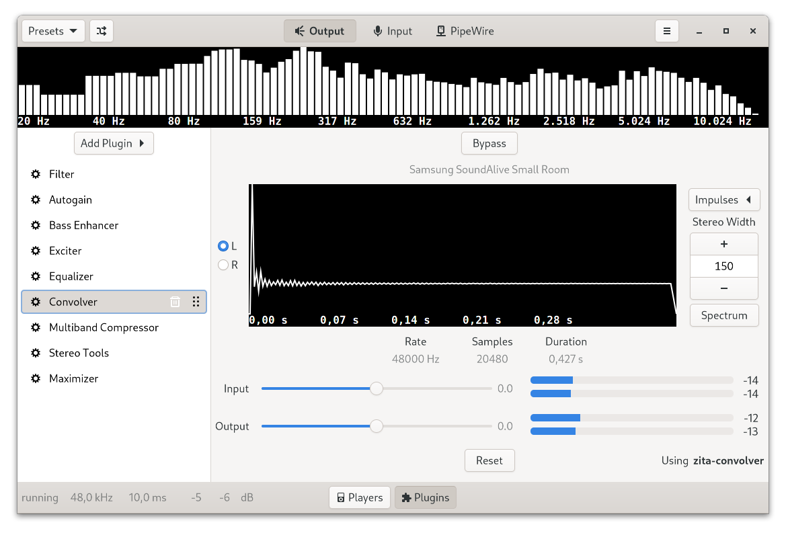
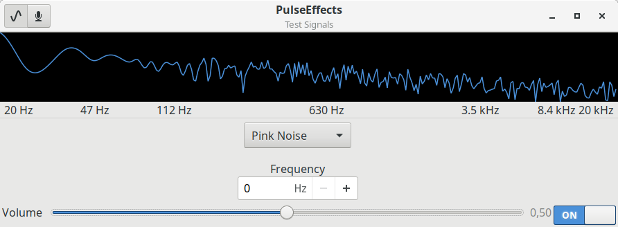

# PulseEffects

Audio effects for Pulseaudio applications.







## Effects available

### Applications output

- Limiter
- Auto gain
- Expander
- Compressor
- Multiband compressor
- Equalizer
- Bass enhancer
- Exciter
- Crystalizer
- Reverberation
- Crossfeed
- Filter (low-pass, high-pass, band-pass and band-reject modes)
- Stereo tools
- Loudness
- Maximizer
- Pitch
- Gate
- Multiband gate
- De-esser
- Convolver

### Applications input

- Gate
- Multiband gate
- WebRTC
- Limiter
- Compressor
- Multiband compressor
- Equalizer
- Reverberation
- Pitch
- Filter (low-pass, high-pass, band-pass and band-reject modes)
- De-esser

The user has full control over the effects order. Just use the up/down arrows
next to the plugin label at the left side. To be able to use all plugins you
must have the following installed in your system:

- [GStreamer plugins "Good"](https://github.com/GStreamer/gst-plugins-good).
Version 1.12.5 or higher
- [GStreamer plugins "Bad"](https://github.com/GStreamer/gst-plugins-bad).
Version 1.12.5 or higher
- [Linux Studio plugins](http://lsp-plug.in/?page=home)
- [Calf Studio plugins](https://calf-studio-gear.org/). Version 0.90.1 or higher.
- [ZamAudio plugins](http://www.zamaudio.com/)
- [MDA.LV2](https://git.drobilla.net/cgit.cgi/mda.lv2.git/about/)
- [libsamplerate](http://www.mega-nerd.com/SRC/index.html)
- [libsndfile](http://www.mega-nerd.com/libsndfile/)
- [zita-convolver](https://kokkinizita.linuxaudio.org/linuxaudio/)
- [libebur128](https://github.com/jiixyj/libebur128)

## Changelog
- For information about changes between versions take a look at our
[changelog](https://github.com/wwmm/pulseeffects/blob/master/CHANGELOG.md)

## Installation

### GNU/Linux packages

- [Arch Linux](https://www.archlinux.org/packages/community/x86_64/pulseeffects/) / [AUR Git version](https://aur.archlinux.org/packages/pulseeffects-git/)
- [Void Linux](https://github.com/void-linux/void-packages/blob/master/srcpkgs/pulseeffects/template)
- [Gentoo](https://packages.gentoo.org/packages/media-sound/pulseeffects/)
- [ROSA](https://abf.io/import/pulseeffects/)
- [ALT Linux](https://packages.altlinux.org/Sisyphus/srpms/pulseeffects/)
- [Fedora GNU/Linux](https://apps.fedoraproject.org/packages/pulseeffects)

#### Community packages

These are community maintained repositories of distribution packages. You can
find more information about these in the
[wiki](https://github.com/wwmm/pulseeffects/wiki/Package-Repositories#package-repositories).

- [Ubuntu and Debian](https://github.com/wwmm/pulseeffects/wiki/Package-Repositories#debian--ubuntu)

### Flatpak

[Flatpak](https://flatpak.org/) packages support multiple Linux distributions and are sandboxed.

Stable releases are hosted on
[Flathub](https://flathub.org/apps/details/com.github.wwmm.pulseeffects):

```
flatpak remote-add --if-not-exists flathub https://flathub.org/repo/flathub.flatpakrepo
flatpak install flathub com.github.wwmm.pulseeffects
```

#### Installing from source

See the wiki: [Installing from Source](https://github.com/wwmm/pulseeffects/wiki/Installation-from-Source), for detailed instructions.

## Documentation

PulseEffects documentation can be read inside the GUI installing 
[yelp](https://gitlab.gnome.org/GNOME/yelp) package.

## Frequently asked questions

Take a look at our [FAQ](https://github.com/wwmm/pulseeffects/wiki/FAQ) to see
if you are facing a known problem.

## Command-line options

See the wiki: [Command Line Options](https://github.com/wwmm/pulseeffects/wiki/Command-Line-Options)

## Community presets

See the wiki: [Community presets](https://github.com/wwmm/pulseeffects/wiki/Community-presets)

## Reporting bugs

See the wiki: [Reporting Bugs](https://github.com/wwmm/pulseeffects/wiki/Reporting-bugs)

## Translating PulseEffects

See the wiki: [Translating PulseEffects](https://github.com/wwmm/pulseeffects/wiki/Translating-PulseEffects), for detailed instructions.

## License

PulseEffects is licensed under GNU General Public License version 3. See [LICENSE file](https://github.com/wwmm/pulseeffects/blob/master/LICENSE.md).
