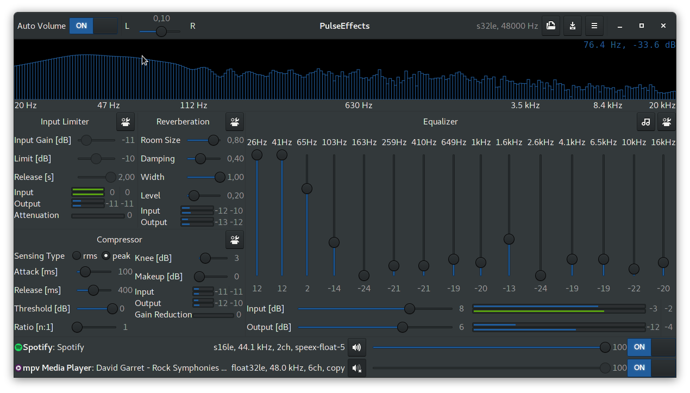
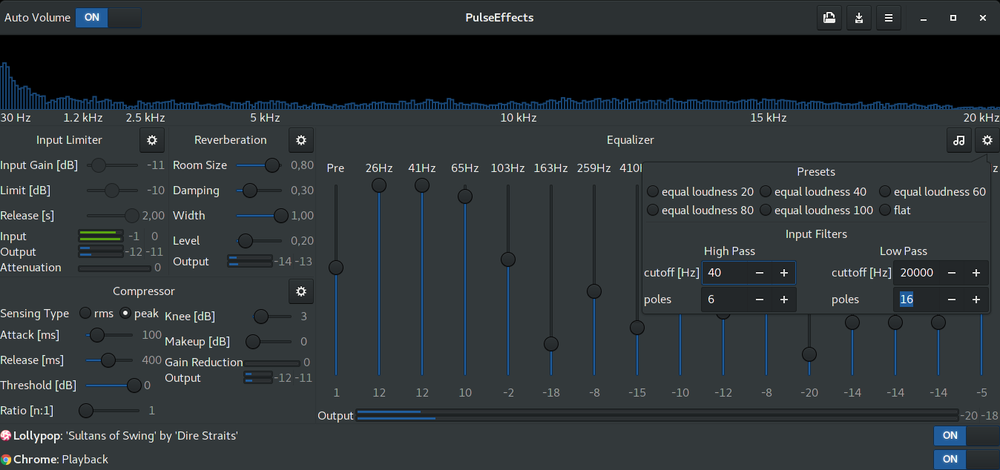
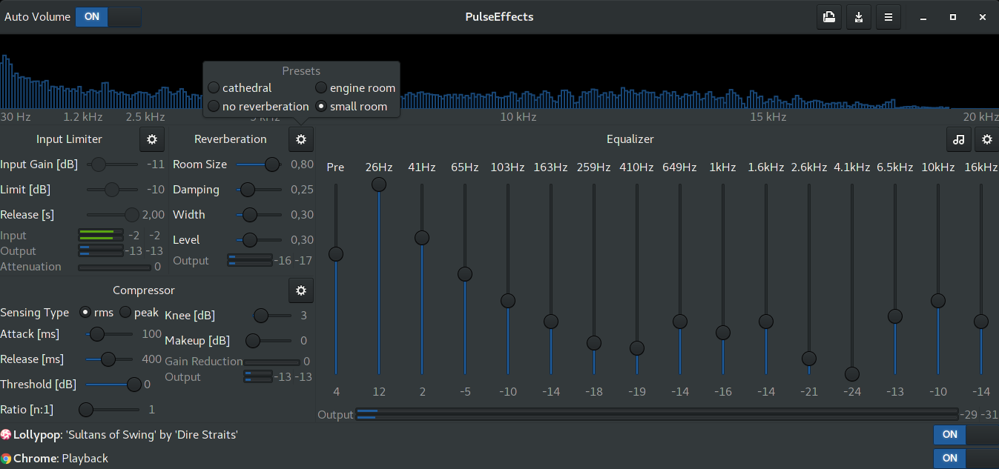

# PulseEffects

Limiter, compressor, reverberation, stereo equalizer and auto volume effects for Pulseaudio applications

Effects order:

1. Fast Lookahead Limiter
2. SC4 Compressor
3. Gstreamer Freeverb
4. Gstreamer Equalizer

Required libraries:

- Python 3
- Python configparser (Python versions higher than 3.5.0 come with it. There is no need to install a separate package)
- PyGobject 3
- Python cairo
- Gtk 3.18 or above
- Gstreamer, Gstreamer Plugins Good, Gstreamer Plugins Bad and Gstreamer Python
 (Since version 1.4.3 Pulseeffects needs Gstreamer 1.12 or above)
- swh-plugins from Ladspa

Arch Linux package:

[https://aur.archlinux.org/packages/pulseeffects/](https://aur.archlinux.org/packages/pulseeffects/)

Note for users trying to install directly from the sources:

The setup.py script only installs the PulseEffects Python module. It does not copy the files inside the share folder to /usr/share. That is because
python setuptools documentation does not recommends this to be done
through it. The ideal solution would be to have a package for your
distribution. If there is not one available and you would like to try to
install by yourself you can try to manualy copy the files in the share folder to the corresponding folders inside /usr/share and then run as root **glib-compile-schemas /usr/share/glib-2.0/schemas/**.

Another option is running PulseEffects without installing it. Do the following steps:

1. git clone https://github.com/wwmm/pulseeffects.git
2. cd pulseeffects
3. glib-compile-schemas share/glib-2.0/schemas/
4. chmod +x pulseeffects
5. GSETTINGS_SCHEMA_DIR=share/glib-2.0/schemas/ ./pulseeffects
