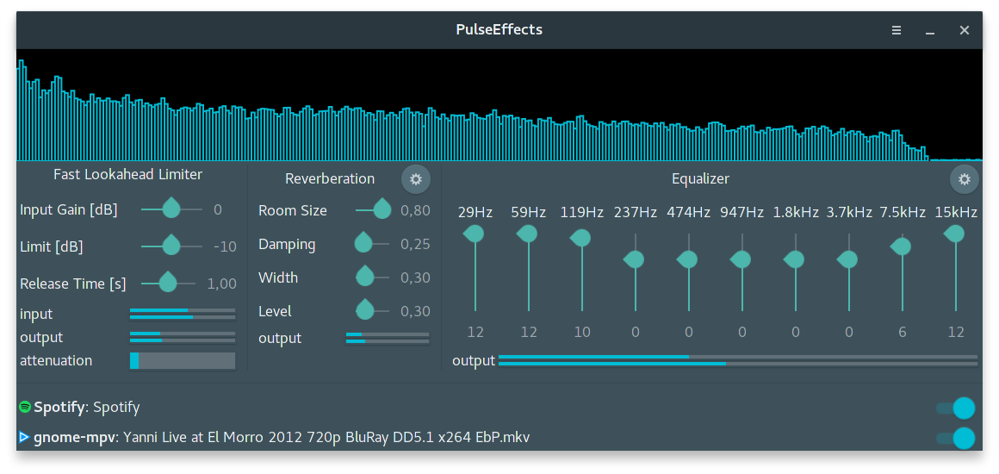
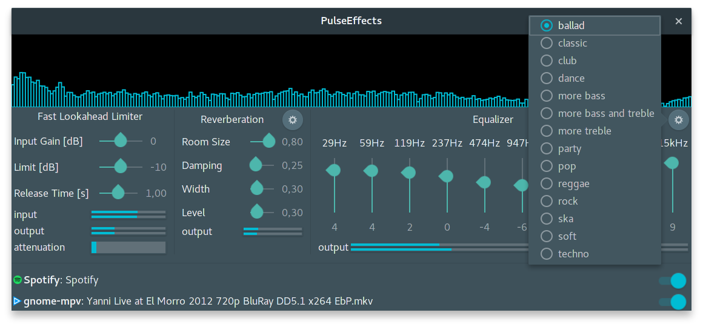
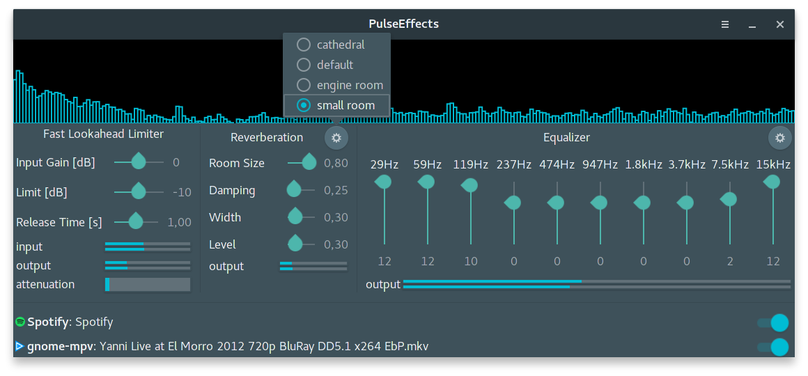

# PulseEffects

Audio effects for Pulseaudio applications

Effects order:

1. Fast Lookahead Limiter
2. Reverberation
3. Equalizer

Required libraries:

- Python 3
- PyGobject 3
- Gtk 3.18 or above
- Gstreamer, Gstreamer Plugins Good, Gstreamer Plugins Bad and Gstreamer Python (version 1.0 or above for all of them)
- swh-plugins from Ladspa
